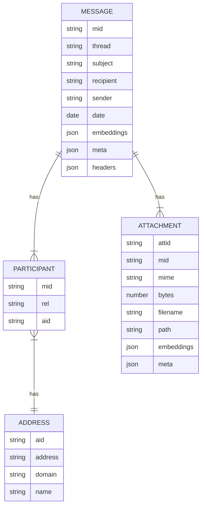

# Mailstats

A terrifying, enormous wad of weirdness.

## Installation

`npm i eaton/mailstats`

## Diagrams, Yo

```mermaid
erDiagram

    MESSAGE ||--|{ PARTICIPANT : has
    PARTICIPANT }|--|| ADDRESS : has
    MESSAGE ||--|{ ATTACHMENT : has

    MESSAGE {
        string mid
        string thread
        string subject
        string recipient
        string sender
        date date
        json embeddings
        json meta
        json headers
    }

    PARTICIPANT {
        string mid
        string rel
        string aid
    }
    
    ADDRESS {
        string aid
        string address
        string domain
        string name
    }

    ATTACHMENT {
        string attid
        string mid
        string mime
        number bytes
        string filename
        string path
        json embeddings
        json meta
    }

```
