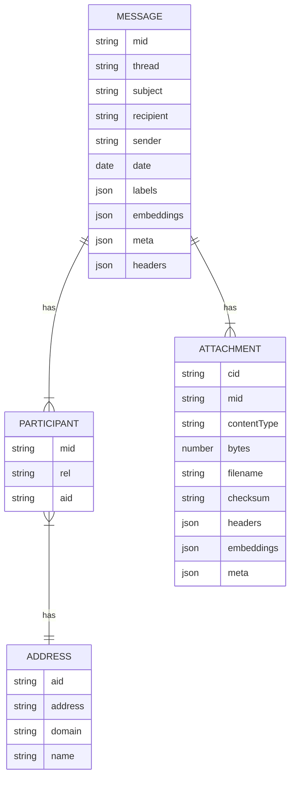

# Mailstats Schema

The database schema is pretty darn simple, consisting of four tables that store individual messages, message attachments, email addresses, and their relationships to each other. Naturally everything revolves around the `message` table.

Two of the JSON fields -- `meta` and `embeddings` -- are convenience buckets for anyone trying to bolt their own analysis code onto the system. By default, the schema expects `meta` to be a JSON key/value object. It can be used to store flags, processed metadata about each message, and so on. The `embeddings` property is a JSON key/value object where each value is an array of numbers, and it can be used to store vector embeddings for assorted hijinks.

Basic use of the library won't populate the `meta` or `embeddings` columns at all; I just needed them for my own purposes and it seemed friendly to leave them in place.

